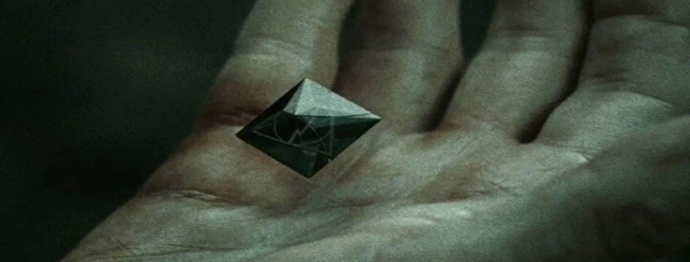

  <a href="https://github.com/uJhin">
    
<!--        -->
<!--      -->
  </a>  

<!-- Last -->

<!--

  <h3>I'm ready to die</h3>

  <i>Harry Potter and the Deathly Hallows: Part 2 (2011)</i>

-->

<!--
# You-Jhin
You-Jhin's GitHub page
## Profile
- [GitHub](https://github.com/uJhin)
- email: `ujhin942@gmail.com`
-->

